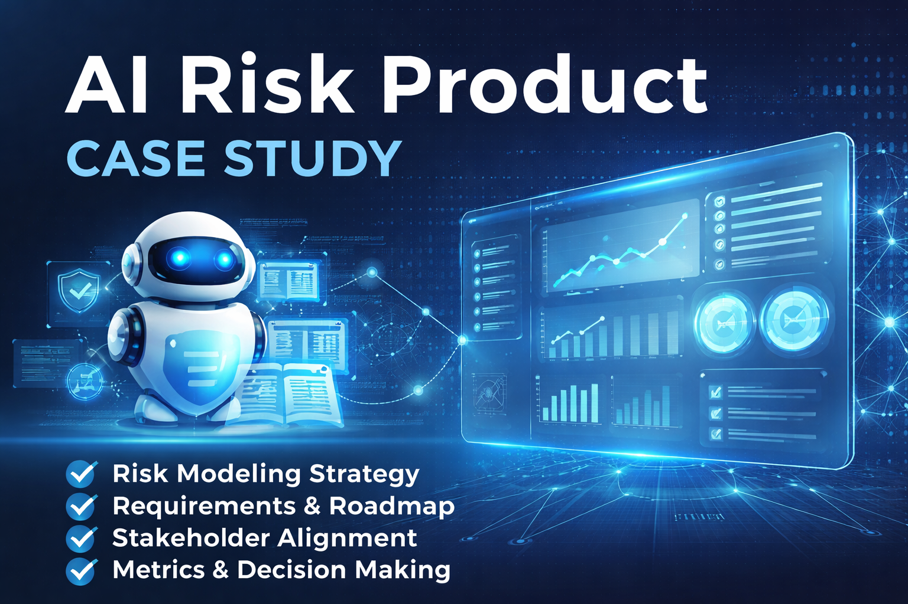

# AI Risk Product Case Study



Portfolio case study on AI/ML risk product strategy, roadmap, requirements, and decision-making.

## Quick Links

- [Problem Statement](problem-statement.md)
- [Product Requirements](product-requirements.md)
- [Roadmap](roadmap.md)
- [User Stories](user-stories.md)
- [Metrics](metrics.md)
- [Risks and Dependencies](risks-and-dependencies.md)

## Overview

This repository presents an anonymized product case study showing how I approach AI-enabled risk products in complex enterprise environments. It highlights product strategy, stakeholder alignment, backlog prioritization, workflow design, and decision-making for risk-focused platforms.

This case study is intended to demonstrate how I think and work as an:

- AI Product Manager
- Product Owner
- Process Engineer

## Context

Enterprise teams adopting AI need products that are useful, compliant, explainable, and operationally sound. In risk-sensitive environments, product leaders must balance user experience, model governance, controls, workflow efficiency, and delivery priorities.

This case study shows how I would structure and lead a product effort involving AI/ML risk workflows, cross-functional stakeholders, and enterprise process constraints.

## Problem Statement

Risk and model governance teams often rely on fragmented processes, manual reviews, disconnected tools, and inconsistent requirements. These issues can slow delivery, reduce visibility, and make it harder for stakeholders to manage model lifecycle activities effectively.

The opportunity is to design a product experience that improves:

- workflow clarity
- stakeholder alignment
- intake and review efficiency
- prioritization of product enhancements
- transparency into risk-related decisions

## Goals

- Define a clear product vision for an AI-enabled risk workflow
- Translate business and user needs into actionable requirements
- Prioritize features using impact, risk, and feasibility
- Improve usability for complex internal workflows
- Support better decision-making through structured product artifacts and metrics

## My Role

In this case study, I demonstrate how I would contribute across:

- Product vision and strategy
- Discovery and requirements gathering
- Backlog prioritization
- User story development
- Workflow and experience design
- Stakeholder communication
- KPI/KRI and success metric framing
- Release and roadmap planning

## Users / Stakeholders

Primary stakeholders may include:

- Risk managers
- Model governance teams
- Product managers and product owners
- Operations teams
- Compliance and control partners
- Technology and engineering teams
- Executive decision-makers

## What This Repository Includes

- Product overview and business context
- Problem framing and opportunity definition
- Product requirements examples
- Sample roadmap
- User stories and acceptance criteria
- Metrics and success measures
- Risks, dependencies, and tradeoffs

## Product Strategy Approach

My approach to AI product strategy in regulated or risk-sensitive environments includes:

1. Understanding the business problem before jumping to features
2. Identifying user pain points across the workflow
3. Balancing usability, controls, and operational efficiency
4. Prioritizing work based on impact, feasibility, and risk
5. Creating clear artifacts that align stakeholders and accelerate delivery
6. Measuring success with both operational and product outcomes

## Example Deliverables

This repository includes documents such as:

- `problem-statement.md`
- `product-requirements.md`
- `roadmap.md`
- `user-stories.md`
- `metrics.md`
- `risks-and-dependencies.md`

## Repository Structure

```text
ai-risk-product-case-study/
│
├── README.md
├── problem-statement.md
├── product-requirements.md
├── roadmap.md
├── user-stories.md
├── metrics.md
├── risks-and-dependencies.md
└── images/
    └── cover.png
```

## Repository Structure

```text
ai-risk-product-case-study/
│
├── README.md
├── problem-statement.md
├── product-requirements.md
├── roadmap.md
├── user-stories.md
├── metrics.md
├── risks-and-dependencies.md
└── images/
    └── cover.png
```

## Key Themes

- AI product strategy
- Risk workflow design
- Product ownership
- Enterprise stakeholder alignment
- Prioritization and roadmap planning
- Process improvement
- Operational transparency
- Human-centered design in complex systems

## Confidentiality Note

All content in this repository is anonymized and intended for portfolio use. Any examples are adapted to avoid sharing proprietary, confidential, or sensitive business information.

## About Me

I build and support products at the intersection of:

- AI/ML product strategy
- Workflow automation
- Product ownership
- Process engineering
- Enterprise transformation

My background includes experience in banking, insurance, consulting, and military healthcare operations, with a focus on AI/ML risk modeling, workflow improvement, and cross-functional product delivery.

## Connect

- LinkedIn: https://www.linkedin.com/in/christopher-d-cole/
- Location: San Antonio, Texas
